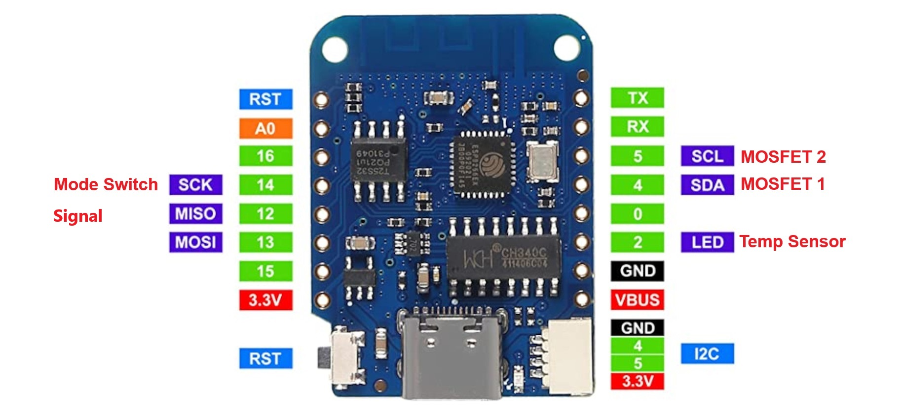
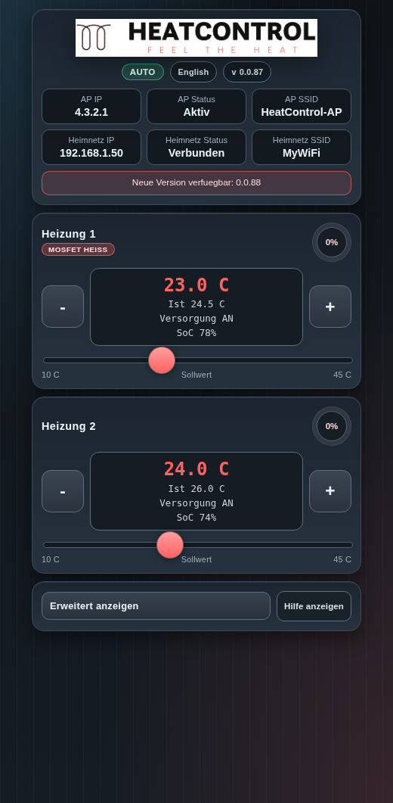

# HeatControl

## Description
HeatControl is a dual-zone heating control system based on the Wemos D1 Mini 4. It provides precise temperature control through DS18B20 sensors and MOSFET-driven outputs, with a web-based interface for monitoring and control.

## Features
- Dual zone temperature control
- Web interface with real-time monitoring
- Adjustable temperature thresholds (10-45°C)
- Persistent settings stored in EEPROM
- Two operation modes:
  - Normal: Temperature-based control
  - Boost: Full power mode (activated via GPIO)
- Swappable sensor assignments
- Captive portal for easy WiFi configuration
- Mobile-friendly responsive design

## Hardware
### Requirements
- Wemos D1 Mini 4
- 2x DS18B20 Temperature Sensors
- 2x MOSFETs (for heating control)
- Step-down converter (15V to 5V)
- 1000µF capacitor
- Pull-up resistors (4.7kΩ for DS18B20)
- Current limiting resistors

### Connections
- DS18B20 Sensors: GPIO 2 (ONE_WIRE_BUS)
- MOSFET 1: GPIO 4 (MOSFET_PIN_1) 
- MOSFET 2: GPIO 5 (MOSFET_PIN_2)
- Mode Switch: GPIO 14 (INPUT_PIN)

## Interface
### Pinout

### Web Interface

The web interface provides:
- Real-time temperature readings
- Individual temperature threshold controls
- Heating status indicators
- Sensor assignment options
- WiFi configuration
- System restart function

## Installation
1. Clone this repository
2. Open project in PlatformIO
3. Upload to Wemos D1 Mini 4
4. Connect to "HeatControl" WiFi network
   - Default SSID: HeatControl
   - Default Password: HeatControl

## Operation
1. Power up the device
2. Connect to the WiFi network
3. Access web interface (IP: 4.3.2.1)
4. Configure temperature thresholds
5. Monitor heating zones

### Operating Modes
- **Normal Mode**: Automatic temperature control based on thresholds
- **Boost Mode**: Maximum power output (GPIO 14 HIGH)

## Contributing
Contributions are welcome! Please submit pull requests for any improvements.

## License
This project is licensed under the MIT License - see the LICENSE file for details.