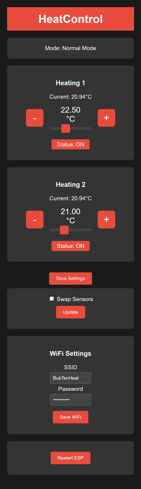

# HeatControl

## Description
HeatControl is a Wemos D1 Mini 4-based heating control system that manages multiple heating zones. It uses temperature sensors to monitor and control heating elements through relays.

## Features
- Control of up to 2 heating zones
- DS18B20 temperature sensor support
- Relay control for each heating zone
- Web interface for monitoring and control
- Temperature threshold settings per zone
- Two operation modes:
  - Normal mode: Standard heating control
  - Boost mode: Enhanced heating performance
- Automatic activation of boost mode after power cycle

## Hardware Requirements
- Wemos D1 Mini 4
- DS18B20 Temperature Sensors
- 2x MOSFETs
- Step-down converter module (to 5V)
- 1000µF capacitor
- Various resistors

## Pinout Diagram

## GUI

The GUI provides an intuitive interface for users to monitor and control the heating system. It displays the current temperature readings from each zone, allows users to set desired temperature thresholds, and provides buttons to activate or deactivate heating zones. The interface is designed to be user-friendly, ensuring that users can easily navigate and make adjustments as needed.

### Connections
- Temperature Sensors (DS18B20): GPIO 2 (ONE_WIRE_BUS)
- MOSFET 1: GPIO 4 (MOSFET_PIN_1) 
- MOSFET 2: GPIO 5 (MOSFET_PIN_2)
- Input Pin: GPIO 14 (INPUT_PIN)

## Installation
1. Clone this repository
2. Open the project in PlatformIO
3. Upload to your Wemos D1 Mini 4

## Usage
1. Power up the Wemos D1 Mini 4
2. Connect to the device's web interface
3. Set your desired temperature thresholds
4. Monitor and control your heating zones

## Contributing
Contributions are welcome! Please submit a pull request for any improvements or bug fixes.